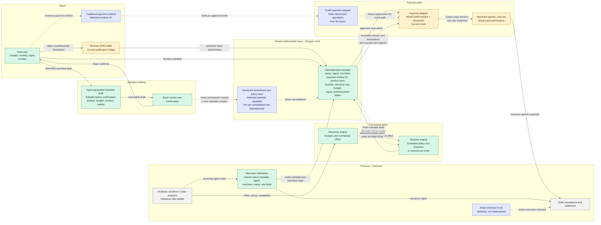

# Chk! Buyer Architecture

This Mermaid diagram is the editable source of the architecture. Edit node text
or arrows directly in this file; GitHub will render it automatically.

Legend: solid arrows are implemented in the current mock, dotted arrows are
the selected target architecture or an integration not yet connected.

## Current implementation notes

- `MandateVault` is an authorization ledger, not a user-funds wallet. In the
  mock, `MockCardProcessor` charges at reservation and holds mock USD until the
  merchant captures or releases the virtual card.
- A browser EVM wallet currently signs `createMandate`. This proves publication
  for the mock, but conflicts with the selected TradFi-first buyer UX; a
  production adapter or relayer remains to be designed.
- `MandateVault` currently supports creation and revocation. Versioned
  amendments and a complete policy hash exist in the separate `MandateModule`
  prototype and are not yet part of the canonical payment flow.
- The agent's discovery and decision modules exist, but the live chain reader
  and UI-to-agent execution bridge are not connected yet.
- The mock virtual-card path is implemented. Stripe is a selected merchant
  checkout direction, not an implemented integration.
